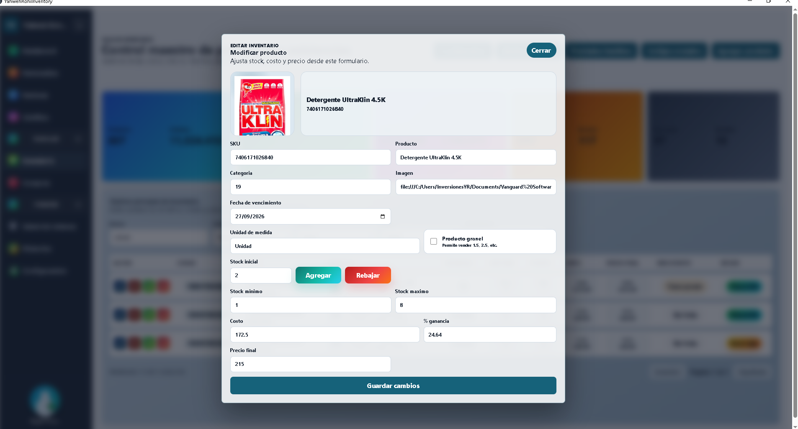

# AGENTS.md

Guia corta para futuros agentes Codex en este proyecto.

## Orden de lectura

1. Leer este archivo primero.
2. Consultar `docs/CURRENT_STATE.md`.
3. Consultar `docs/ARCHITECTURE.md` solo si la tarea requiere arquitectura.
4. Consultar `docs/MODULES.md` para ubicar el modulo afectado.
5. Consultar `docs/DATABASE.md`, `docs/BUSINESS_RULES.md` o `docs/PERFORMANCE.md` solo cuando sean relevantes.

## Reglas de trabajo

- No analizar todo el repositorio automaticamente al comenzar.
- Inspeccionar primero solo el modulo y archivos directamente relacionados.
- Ampliar busqueda solo si hay una dependencia real o si `/docs` no coincide con el codigo.
- No modificar, reiniciar ni detener la aplicacion de escritorio sin permiso explicito; es la interfaz principal de facturacion en uso con clientes.
- No revertir cambios existentes sin solicitud explicita.
- Despues de cambios importantes actualizar `docs/CURRENT_STATE.md`.
- Al completar una funcionalidad agregar una entrada breve a `docs/CHANGELOG_CODEX.md`.
- Si cambia arquitectura, actualizar `docs/ARCHITECTURE.md`.
- Si cambia una regla funcional, actualizar `docs/BUSINESS_RULES.md`.
- Si cambia base de datos, actualizar `docs/DATABASE.md`.
- Si cambia una optimizacion importante, actualizar `docs/PERFORMANCE.md`.

## Modo web / red

- El puerto `4200` puede exponerse por NIC para pruebas/acceso web desde otros equipos.
- Separar siempre el diagnostico web en tres capas: Angular/Vite en `4200`, proxy `/api` y backend HTTP en `3000`.
- La carga de usuarios del login usa `GET /api/auth/users`; si falla en navegador web pero escritorio funciona, validar primero si `4200` escucha en la NIC correcta y si el proxy llega a `127.0.0.1:3000`.
- Para acceso desde otros equipos, Angular/Vite debe iniciarse escuchando fuera de loopback en todas las interfaces activas con `npm run web:dev` (`--host 0.0.0.0 --port 4200`). No cambiar scripts de arranque sin permiso.
- No exponer secretos de `.env`; solo confirmar nombres de variables o valores redactados durante diagnostico.
  
o actau
